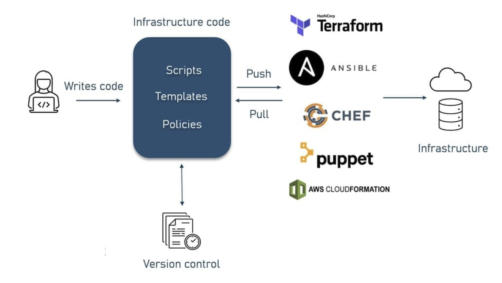
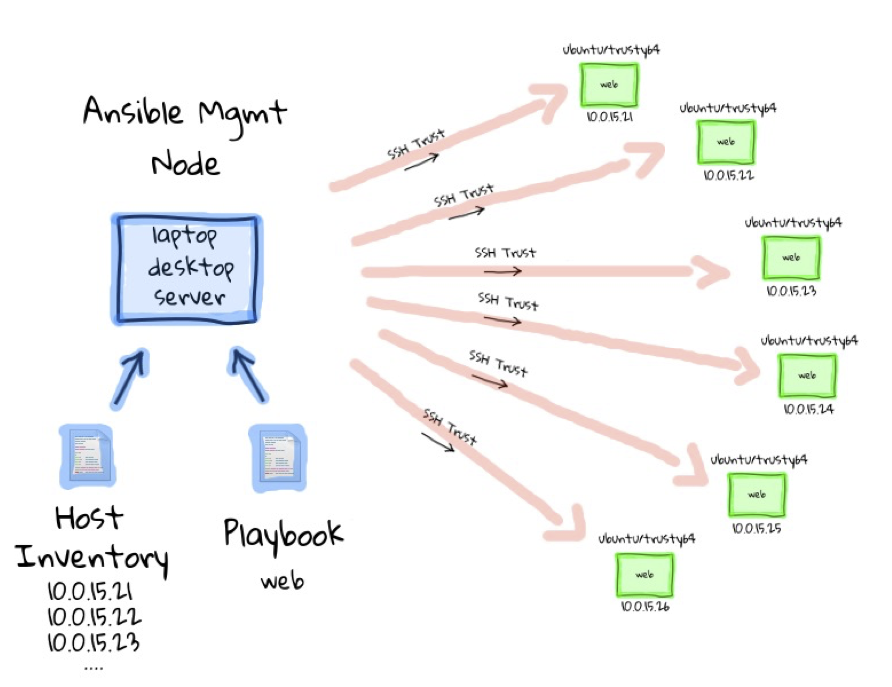

# Infrastructure as Code (IaC)

<div class="columns" style="font-size: 0.9em; display: flex; gap: 1em;">

<div style="flex: 1;">

- Describe infrastructure using code/text
  - Virtual Machines, Networks, Load Balancers, Services
- Tools automate deployment and configuration
  - Terraform: build infrastructure
  - Ansible, Chef, Puppet: configure it
- Benefits
  - Reproducability
  - Version control
  - Less human error
  
</div>

<div style="flex: 1;">



</div>

</div>

---

# Ansible

Open-source tool for automating configuration and deployment

- Agentless: Operates over SSH, eliminating the need to install any software on remote systems
- Declarative language: Uses a simple and human-readable YAML syntax to describe the desired state of your systems
- Idempotent: A task can be executed repeatedly with the same effect as running it once – changes are applied only if required

---

# How Ansible works

<div class="columns" style="display: flex; gap: 1em;">

<div style="flex: 0.8;">

- You define the desired system state in a playbook
- Ansible connects via SSH to target machines
- Ansible makes the system match the playbook
  
</div>

<div style="flex: 1;">



</div>

</div>

---

<!-- # Push based vs. Pull based

- Tool like Puppet and Chef are pull based
   - Agents on the server periodically checks for the configuration information from central server (Master)
- Ansible is push based
   - Central server pushes the configuration information on target servers
   - You control when the changes are made on the servers
   - Ansible has official support for pull  mode, using a tool  it ships with called ansible-pull

---

# Push based vs. Pull based (cont'd)


--- -->

# Host inventory

<div class="columns" style="display: flex; gap: 1em;">

<div style="flex: 1;">

- Ansible can manage only the servers it explicitly knows about
- Information about devices is provided by specifying them in an inventory file
- Each server needs a name that Ansible will use to identify it. You can use the hostname of the server.
- Pass additional arguments to tell Ansible how to connect to it
- Default location is /etc/ansible/hosts
  
</div>

<div style="flex: 1;">

```bash
[production:children]
webservers
dbservers
proxies

[webservers]
foo.example.com http_port=80
bar.example.com http_port=8080

[dbservers]
db[01:03].example.com

[dbservers:vars]
pgsql_bind_nic=eth1

[proxies]
192.168.1.1
```

</div>

</div>

---

# Modules

- Modules (also referred as task plugins or library plugins) are the ones which actually get executed inside playbook
- These are scripts that come packaged with Ansible and preform some kind of action on a host
- Example:
   - `apt`: Installs or removes packages using the apt package manager
   - `copy`: Copies a file from local machine to the hosts
   - `file`: Sets the attribute of a file, symlink, or directory
   - `service`: Starts, stops, or restarts a service

---

# YAML basics

- Start of file: `---`
- Comments: `#`
- List: `- <item>` or `[<item>, <item>]`
- Dictionary/Mapping: `<label>:<value>` or `{<label>:<value>}`
- Line Folding: `>`

---

# YAML example

```yaml
---
# This is a description by YAML
name: Alice
family: NA
Address: Wonderland, >
               Antipodes
ID:1111
Courses:
  - course_name: abc
    course_id: 123
  - course_name: xyz
    course_id: 456
```

---

# Ansible playbook

- Ansible’s configuration, deployment, and orchestration language 
- Written in YAML, declaratively define your configuration
- A playbook describes which hosts (what Ansible calls remote servers) to configure, and an ordered list of tasks to perform on those hosts.
- Command to run the playbook:

   ```
   ansible-playbook file.yml
   ```

---

# Playbook simple example

```
- name: a test playbook
  hosts: webservers
  tasks:
      - name: check connectivity
        ping:
      - name: just a touch
        command: touch /tmp/123.txt
```

---

# Notes on running playbook 

- Ansible runs each task in parallel across all hosts
- Ansible waits until all hosts have completed a task before moving to the next task
- Ansible runs the tasks in the order that you specify them

---

# Ansible features

- Easy-to-Read Syntax: built on top of YAML
- Agentless: no need for agent installation and management
- Built on top of Python and hence provides a lot of Python’s functionality
- Uses SSH for secure connections
- Follows Push based architecture for sending configurations
- Very easy and fast to setup, minimal requirements
- Built-in Modules
   - Ansible modules are *declarative*; you use them to describe the state you want the server to be in.
   - Modules are also *idempotent*. It means that it’s safe to run an Ansible playbook multiple times against a server

---

# Demo: Configure webserver with nginx 

- Open a remote SSH terminal session to `node0`

- Create inventory file `hosts`

   ```
   [webservers]
   node2
   ```

---

# Demo: Configure webserver with nginx (cont'd)

<div class="columns">

<div>

- Create playbook file `nginx.yml`
  
</div>

<div>

```
- name: Setup web server
  hosts: webservers
  become: true
  vars:
    web_root: "/var/www/html"
  tasks:
    - name: Install nginx
      apt:
        name: nginx
        state: present

    - name: Ensure nginx is running
      service:
        name: nginx
        state: started
        enabled: true

    - name: Copy index.html
      copy:
        src: index-ansible.html
        dest: "{{ web_root }}/index.html"
```

</div>

</div>

---
# Demo: Configure webserver with nginx (cont'd)

- Run playbook

   ```
   ansible-playbook -i ./hosts nginx.yml
   ```

- Visit `http://node2/index.html`

- Web page should look like this:

   ```
   nginx, configured by Ansible
   If you can see this, Ansible successfully installed nginx.
   ```

---

# Advanced Ansible

---

# Handlers
- Handlers usually run after all of the tasks
- Handlers are triggered by `notify` command
- They run only once, even if they are notified multiple times. 
- If a play contains multiple handlers, the handlers always run in the order that they are defined in the handlers section, not the notification order.
- The official Ansible docs mention that the only common uses for handlers are for restarting services and for reboots

---

# Handler simple example

```yaml
--- 
- name: a test playbook
  hosts: test1
  handlers:
      - name: record new
        command: touch /tmp/new.txt
  tasks:
      - name: check connectivity
        ping:
      - name: just a touch
        command: touch /tmp/123.txt
        notify: record new
```

---

# Variables

- The simplest way to define variables is to put a `vars` section in your playbook with the names and values of variables
- `{{ variable_name }}` is substituted by its value
- To set the value of a variable based on the result of a task, we create a *registered variable* using the register clause when invoking a module.
   - The value of variable is the *dictionary*, we can access its fields

---

# Variables simple example

```yaml
--- 
- name: a test playbook
  hosts: test1
  vars:
      target_file: /tmp/123.txt
      new_file: /tmp/new.txt
  handlers:
      - name: save time
        shell: echo {{ date_var.stdout }} > {{ new_file }}
      - name: get time
        command: date
        register: date_var
        notify: save time
  tasks:
      - name: just a touch
        command: touch {{ target_file }}
        notify: get time
```

---
# Facts

- When Ansible gathers facts, it connects to the host and queries it for all kinds of details about the host
   - CPU architecture
   - operating system
   - IP addresses
   - memory info
   - ...
- This information is stored in variables that are called *facts*, and they behave just like any other variable.

---

# Facts simple example

```yaml
--- 
- name: Test Facts
  hosts: test1
  gather_facts: True
  tasks:
      - debug: var=ansible_distribution
      - debug: var=ansible_architecture
      - debug: var=ansible_bios_date
      - debug: var=ansible_devices
```
