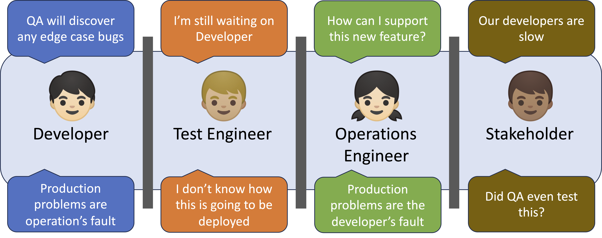
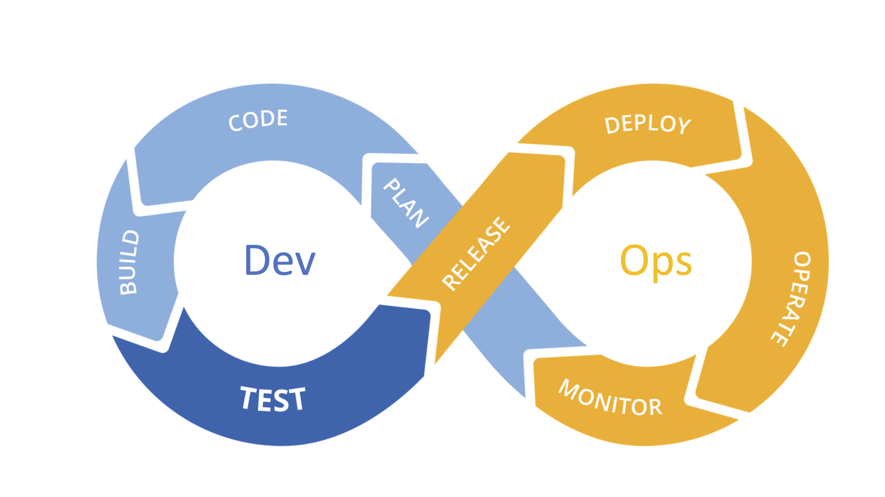

# The Problem

Traditional delivery models cause team conflicts and delays due to misaligned priorities and mindsets



---

# What is DevOps?

A set of practices, tools, and a cultural philosophy that automates and integrates the processes between software development and IT operations


<div style="text-align: center;">Continuous Integration – Continuous Delivery</div>

---

# Why DevOps?

Reduces the time to market without impacting the quality or value of the software application that is being delivered


---

# DevOps Tooling


---

# DevOps in Action: Installing Nginx

We want to automate the deployment of a simple web server using nginx

Here is the starting point:

```bash
# nginx.sh
#!/bin/bash
sudo apt update
sudo apt install -y nginx
sudo systemctl enable nginx
sudo systemctl start nginx
```

---

# Our plan

We’ll explore how 3 tools help with this task:

Tool | Role in DevOps | How we’ll use it
:-----|:-----------------|:------------------
Git  | Version control | Track changes to scripts and static files
SSH  | Remote access | Execute commands and transfer files on remote servers
parallel-ssh | Parallel remote execution | Run scripts across multiple nodes simultaneously

---

# Version Control with Git

---

# Demystifying Git and GitHub

*Git* is the software that allows us to do version control

- Git tracks changes to your source code so that you don’t lose any history of your project

*Github* is an online platform where developers host their source code (and can share it the world)

- You can host remote repositories on https://github.com/
- You edit and work on your content in your local repository on your computer, and then you send your changes to the remote

---

# Why Git for DevOps?

- Keep track of your infrastructure code

- Collaborate with others

- Revert to previous versions if needed

---

# Workflow


---
# Getting started

SSH into `node0` with agent forwarding enabled

Verify Git installation:

```bash
git --version
```

If Git is missing, install it:

```bash
sudo apt -y install git
```

Configure Git with your user info:

```bash
git config --global user.name "Your Name"  
git config --global user.email "you@example.com"
```
---

# Git in action

```bash
# create a new directory, and initialize it with git-specific functions
git init my-devops-lab

# change into the `my-devops-lab` directory
cd my-devops-lab

# git isn't aware of the file, stage it
git add nginx.sh

# take a snapshot of the staging area
git commit -m "Initial commit: NGINX setup script"
```

---

# Hosting your source code on GitHub

Visit https://github.com/new to create a new GitHub repository


---

# Pushing changes to the remote repository

```bash
# set a new remote
git remote add origin git@github.com:YOUR-USERNAME/YOUR-REPOSITORY-NAME.git

# rename your local branch to main
git branch -M main

# push commits made on your local branch to a remote repository
git push -u origin main
```

---
# Adding static web page

Create an index.html:

```html
<h1>Hello from DevOps!</h1>
```

Track it with Git:

```bash
git add index.html
git commit -m "Add static index.html"
git push
```

---

# More git commands

- Check status: git status
- Ignore files: use a .gitignore file
- Pull commits: git pull
- Clone repository: git clone
- View history: git log
- Undo commit: git revert <commit-hash> (safe, creates new commit)

---
# Remote Access with SSH
---

# What is SSH?

- Secure way to run commands on remote machines

- Underpins most DevOps tools

---

# SSH: Running commands remotely

SSH allows us to execute commands on a remote machine:

```bash
ssh username@remote-host 'bash -s' < nginx.sh
```

- This installs and starts NGINX on the remote host
- We don’t need to copy the script, just stream it over SSH

---

# SCP: Transferring files

To serve the static page, we need to transfer index.html:

```bash
scp index.html username@remote-host:/tmp/
```

Then manually copy it via SSH:

```bash
ssh username@remote-host \
  'sudo cp /tmp/index.html /var/www/html/index.html'
```

---
# Limitations of SSH + Scripts

- Manual and error-prone

- Hard to track what's changed

- Not idempotent (may run same task unnecessarily)

- Not scalable to many machines

---

# Remote Execution with Parallel SSH

---

# Parallel SSH

- For clusters with > 2 machines, use [`parallel-ssh`](https://manpages.org/parallel-ssh)
- Run commands **in parallel** on many hosts simultaneously
- Ideal for managing larger deployments efficiently

---

# Getting Started

1. Pick a management machine (e.g., `node0`)  
2. Setup **passwordless SSH** access to all managed nodes  
3. Create a `hosts` file listing all nodes  
4. Start using `parallel-ssh` commands  

> Use CloudLab profiles under `UCY-COAST-TEACH` for auto ssh-key setup

---

# Installing `parallel-ssh`

On Debian-based systems:

```bash
sudo apt -y install pssh
```

---

# Running Commands

Create hosts file:

```
node2
node3
```

Run command on all hosts:

```bash
parallel-ssh -i -h hosts date
```

```
parallel-ssh -i -h hosts -- sudo apt -y install nano
```

-i shows output as each host finishes

---

# Running a Script Remotely

Send and execute a local script `nginx.sh` on all nodes:

```
parallel-ssh -h hosts -i -I < ./nginx.sh
```

- No need to transfer script files manually

- Script runs via bash on each node

---

# Transferring Files with parallel-scp

Copy `index.html` to home directories on all nodes:

```bash
parallel-scp -h hosts index.html ~/
```

Move file to privileged location with sudo:

```bash
parallel-ssh -h hosts 'sudo mv ~/index.html /var/www/html/index.html'
```

---

# Verify Deployment

Visit:

```
http://<remote-host-ip>
```

Check if the static page loads successfully.

---

# Exercise: Collect & Analyze Nginx Logs

- Use `parallel-ssh` to get last 50 lines of /var/log/nginx/access.log from all hosts

- Use `parallel-scp` to copy logs locally (access_nodeX.log)

- Write a bash script to find 4xx/5xx errors in logs

- Summarize error counts by host

---

# Recap

- DevOps: Automates collaboration between dev and ops

- Git: Tracks code and config changes

- SSH: Runs remote commands securely

- parallel-ssh: Executes tasks across many nodes