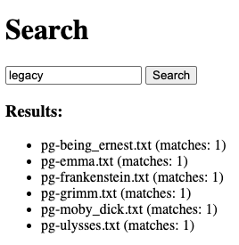
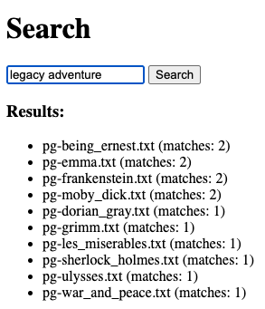

# Lab: Web Search

In this lab tutorial, you'll begin building a document search web application in Go. The project begins with a simple, standalone server. As you work through the subsequent labs, you’ll incrementally enhance and scale your application into a distributed document search system capable of efficiently handling large collections of documents across multiple nodes.

## Prerequisites

### Setting up the Experiment Environment in Cloudlab

For this tutorial, you will be using a CloudLab profile that comes with the latest version of Go. 

Start a new experiment on CloudLab using the `multi-node-cluster` profile in the `UCY-COAST-TEACH` project, configured with a single physical machine node. 

Open a remote SSH terminal session to `node0`.

Verify that the profile has a working installation of Go by typing the following command:

```
$ go version
```

Confirm that the command prints the installed version of Go. If you don't have Go installed then just follow the [download and install](https://go.dev/doc/install) steps.

## Introducing the net/http Package

Go is fantastic for building web applications of all shapes and sizes. This is partly due to the fantastic work that has been put into making the standard library clean, consistent, and easy to use.

Perhaps one of the most important packages for any budding Go web developer is the `net/http` package. This package allows you to build HTTP servers in Go with its powerful compositional constructs. Before we start coding, let's do an extremely quick overview of HTTP.

> You can skip this section if you’re already familiar with `net/http`.

### HTTP Basics

When we talk about building web applications, we usually mean that we are building HTTP servers. HTTP is a protocol that was originally designed to transport HTML documents from a server to a client web browser. Today, HTTP is used to transport a whole lot more than HTML.

<figure>
  <p align="center"></p>
  <figcaption><p align="center">Figure. HTTP request/response</p></figcaption>
</figure>

The important thing to notice in this diagram is the two points of interaction between the *Server* and the *Browser*. The Browser makes an HTTP request with some information, the Server then processes that request and returns a Response.

This pattern of request-response is one of the key focal points in building web applications in Go. In fact, the `net/http` package's most important piece is the `http.Handler` Interface.

### The http.Handler Interface

As you become more familiar with Go, you will notice how much of an impact interfaces make in the design of your programs. The `net/http` interface encapsulates the request-response pattern in one method:

```
type Handler interface {
    ServeHTTP(ResponseWriter, *Request)
}
```

Implementors of this interface are expected to inspect and process data coming from the `http.Request` object and write out a response to the `http.ResponseWriter` object.

The `http.ResponseWriter` interface looks like this:

```
type ResponseWriter interface {
    Header() Header
    Write([]byte) (int, error)
    WriteHeader(int)
}
```

### Registering Handlers
You use `http.HandleFunc` to associate URL paths with handler functions:

```go
http.HandleFunc("/", rootHandler)
```

This tells the server to run `rootHandler` for requests to `/`.

### Starting the Server
To start the HTTP server listening for requests, call:

```go
log.Fatal(http.ListenAndServe(addr, nil))
```

- `addr` is the address (e.g., ":8080") the server listens on.
- nil means using the default request multiplexer (`http.DefaultServeMux`) to dispatch routes.

This function blocks, continuously accepting connections.

### Concurrency Model

The server handles each request in its own goroutine. Here’s how it works:

```
Main Goroutine
 ├─ Listens on :8080 and accepts connections
 ├─ For each accepted request:
 │    └─ Spawns a new goroutine
 │         └─ Runs the handler function
```

This allows your server to handle many requests simultaneously without blocking.

### API reference

For additional API reference, use the [Go HTTP API Cheatsheet](docs/cheatsheet.md) provided in the `docs/` folder. It covers key `net/http` usage like handlers, query parsing, and JSON responses to help you complete the lab.

## Part 1: Implementing Web Search Server

We've provided a partial implementation of the server to get you started. 

Your job will be to complete it by implementing the handlers for serving the `/` and `/api/search` endpoints.

Please change your working directory to the directory that contains the partial implementation like so:

```
$ cd labs/05-websearch/starter
```

The application directory structure follows the [Standard Go Project Layout](https://github.com/golang-standards/project-layout). It's not an official standard defined by the core Go dev team; however, it is a set of common historical and emerging project layout patterns in the Go ecosystem. 
- `/cmd`: Contains the main application for this project. The directory name for each application matches the name of the executable we want to have. In our case, the directory name is `websearch`.
- `/internal`: Contains the private application and library code. This is the code you don't want others importing in their applications or libraries. In our case, it contains the code of the inverted index and other helper code. 
- `/test`: Contains external test apps and test data. In our case, it includes the inverted index data that is used as input during development or when running tests.
- `/web`: Contains web application specific components: static web assets, server side templates and SPAs. In our case, it contains the HTML file for the search page.

### The `/` route – Serving the main page

You’ll begin by setting up the main entry point for the application. This involves creating a simple HTML form that allows users to enter a search query and displays the search results.

When a user navigates to the root URL of the application (`/`), they should be presented with the main interface of the search application. To achieve this, implement the `rootHandler` function in `cmd/webserver/main.go`. This handler should serve the `index.html` file located at `web/static/index.html`.

The `index.html` file serves as the front end of the application. It provides a search form where users can type in queries. Once the user submits a query, a JavaScript function is triggered, which sends an HTTP GET request to the `/api/search` endpoint to fetch relevant search results.

<figure>
  <p align="center"></p>
  <figcaption><p align="center">Figure. Search application main page</p></figcaption>
</figure>

### The `/api/search` route – Handling search queries

Next, you’ll implement the `searchHandler` function, which processes search queries sent to the `/api/search` endpoint via GET requests.

This endpoint expects a query parameter in the form `?q=...`, containing one or more space-separated keywords.

This route serves as the core of the web search application, connecting the user queries with your backend search logic.

In your implementation of `searchHandler`, perform the following steps:
1. Extract the query string from the request.
2. Tokenize and normalize the keywords (e.g., lowercasing, removing punctuation).
3. Perform a lookup on the inverted index to find matching documents.
4. Return the matched results as a JSON response to the client.

The inverted index maps keywords to the documents containing them, enabling fast retrieval without scanning every file for each query. A functional implementation is available in the `internal/invertedindex` package, which provides methods to load and query the index based on search terms. Currently, the index file is parsed on every query, which works but causes overhead as the number of queries increases. You will optimize this later to improve efficiency.

### Listening for requests

To begin handling incoming HTTP requests, you need to set up the server and register the appropriate route handlers to handle the `/` and `/api/search` endpoints and then start the server. 

## Building 

Having completed the implementation of our Web Search app, we are now ready to build and run our app. For this lab tutorial, we will do a single node deployment. 

Build the Hotel Map service:

```
$ go mod init github.com/ucy-coast/websearch
$ go mod tidy
$ go build ./cmd/...
```

Run the Web Search application:

```
./webserver -addr :8080 -index /test/invertedindex-small.txt
```

## Testing

To verify functionality via unit tests, run the following from the project root:

```
go test ./...
```

To test the web interface, visit:

```
http://<node0-public>:8080
```

where you replace `<node0-public>` with the public DNS of `node0`, which you can get from the CloudLab dashboard.

The application should present a search form where users can type in queries. 

<figure>
  <p align="center"></p>
  <figcaption><p align="center">Figure. Search application main page</p></figcaption>
</figure>

To begin, type a single-keyword query such as `legacy` and click the **Search** button. This will display a results page with relevant matches.

<figure>
  <p align="center"></p>
  <figcaption><p align="center">Figure. Search results</p></figcaption>
</figure>

Next, type a multi-keyword query such as `legacy adventure`. The results page will show documents that match one or more of the keywords.

<figure>
  <p align="center"></p>
  <figcaption><p align="center">Figure. Search results ranked by relevance</p></figcaption>
</figure>

The results are ranked by relevance: documents containing more of the query keywords appear higher in the list. For example, **matches: 2** indicates the document contains both keywords, while **matches: 1** means it contains only one.

As another test, you can try sending a search query directly to the web application:

```
http://<node0-public>/api/search?q=legacy
```

The web application should respond with a JSON document that lists the documents containing the specified keyword.

```json
[{"Document":"pg-being_ernest.txt","Matches":1},{"Document":"pg-emma.txt","Matches":1},{"Document":"pg-frankenstein.txt","Matches":1},{"Document":"pg-grimm.txt","Matches":1},{"Document":"pg-moby_dick.txt","Matches":1},{"Document":"pg-ulysses.txt","Matches":1}]
```
## Part 2: Benchmarking

With our web application running correctly, we can now evaluate its performance using the [hey](https://github.com/rakyll/hey) load generator.

To view usage information, run:

```bash
hey
```

### Installing `hey`

If `hey` is not already installed, you can install it in your home directory. Open a separate terminal on `node0` and run:

```bash
go install github.com/rakyll/hey@latest
```

By default, this installs the binary to `$HOME/go/bin`. To ensure it's available in your shell, add that directory to your `PATH`.

### Running a Basic Benchmark

Let’s start with a simple load test:

```
hey -z 30s -c 10 -q 1000 http://<node0-public>:8080/
```

This command runs a 30-second test with 10 concurrent workers, each sending 1000 queries per second (QPS), for a total load of approximately 10,000 QPS.

Sample Output:

```
Summary:
  Total:	30.0011 secs
  Slowest:	0.0045 secs
  Fastest:	0.0003 secs
  Average:	0.0005 secs
  Requests/sec:	9175.1428
  
  Total data:	289027200 bytes
  Size/request:	1050 bytes

Response time histogram:
  0.000 [1]       |
  0.001 [265258]	|■■■■■■■■■■■■■■■■■■■■■■■■■■■■■■■■■■■■■■■■
  0.001 [9125]    |■
  0.002 [682]     |
  0.002 [146]     |
  0.002 [27]      |
  0.003 [3]	      |
  0.003 [1]	      |
  0.004 [8]	      |
  0.004 [9]	      |
  0.005 [4]	      |


Latency distribution:
  10% in 0.0004 secs
  25% in 0.0004 secs
  50% in 0.0005 secs
  75% in 0.0005 secs
  90% in 0.0006 secs
  95% in 0.0006 secs
  99% in 0.0009 secs

Details (average, fastest, slowest):
  DNS+dialup:	0.0000 secs, 0.0003 secs, 0.0045 secs
  DNS-lookup:	0.0000 secs, 0.0000 secs, 0.0020 secs
  req write:	0.0000 secs, 0.0000 secs, 0.0021 secs
  resp wait:	0.0004 secs, 0.0002 secs, 0.0021 secs
  resp read:	0.0000 secs, 0.0000 secs, 0.0038 secs

Status code distribution:
  [200]	275264 responses
```

Pay attention to the following key metrics:
- Throughput (Requests/sec): This is the number of successful HTTP requests the server handled per second. Higher throughput generally indicates better server performance — up to the point of saturation.
- Average Latency: This is the mean time taken to process each request, measured from the moment it's sent until the response is fully received. As load increases, average latency usually increases due to queuing and resource contention.
- 99% Latency (99th percentile): This shows how long it took to serve 99% of requests. It's a good indicator of "tail latency", the worst-case performance most users will experience. A low 99% latency is critical for responsive systems, especially under high load.

Together, these metrics help you understand how well your system handles concurrent traffic, and at what point it starts to degrade.

### Scaling the Load

Repeat the test while increasing the number of concurrent workers: 10, 50, 100, 200, 300, 400, and 500. Continue until the system reaches saturation, that is the point at which increasing workers no longer results in higher throughput.

Sample results:

| Workers | Throughput (QPS) | Average Latency (s) | 99% Latency (s) |
|---------|------------------|---------------------|-----------------|
| 10      | 9615.0908        | 0.0005              | 0.0010          |
| 50      | 34346.0702       | 0.0014              | 0.0056          |
| 100     | 63324.9096       | 0.0028              | 0.0067          |
| 200     | 97063.3137       | 0.0060              | 0.0062          |
| 300     | 97951.2292       | 0.0090              | 0.0088          |
| 400     | 97457.0589       | 0.0120              | 0.0117          |
| 500     | 98021.4261       | 0.0150              | 0.0146          |

Note that once the server hits its throughput limit (beginning around 200 workers), further increases in concurrency will not improve QPS. Instead, it will lead to higher response latency due to increased queuing. This point of saturation varies depending on the server's capacity, you may observe it earlier or later depending on your hardware.

Also note that at or beyond saturation (starting around 300 workers), the average latency exceeds the 99th percentile latency. This indicates the presence of a few very slow outlier requests skewing the average. For example, at 300 workers, the slowest request was 0.227s, significantly above the norm, which distorts the average but not the 99th percentile.

### Benchmarking the Search Endpoint

To simulate a more realistic workload, you can benchmark an actual application endpoint such as `/api/search`. This endpoint may involve querying an index, filtering, or ranking, which more accurately reflects production conditions.

Run the following command to benchmark the search API with a sample query:

```bash
hey -z 30s -c 10 -q 1000 http://<node0-public>:8080/api/search?q=legacy
```

You can experiment with different queries to see how they affect performance (e.g., long vs. short results, common vs. rare terms) and different numbers of concurrent workers. Since search endpoints often involve in-memory data structures, disk I/O, or application logic, they may behave differently than the root path (`/`). Expect higher latencies and potentially lower throughput depending on implementation.

Use the same performance metrics as before to evaluate the search endpoint.

Sample results:

| Workers | Throughput (QPS) | Average Latency (s) | 99% Latency (s) |
|---------|------------------|---------------------|-----------------|
| 10      | 3489.1004        | 0.0029              | 0.0052          |
| 50      | 3396.9418        | 0.0147              | 0.0493          |
| 100     | 4582.1376        | 0.0218              | 0.0723          |
| 200     | 6136.2146        | 0.0326              | 0.1466          |
| 300     | 6874.3704        | 0.0436              | 0.2258          |
| 400     | 7455.3035        | 0.0536              | 0.2988          |
| 500     | 7925.0066        | 0.0630              | 0.3719          |

## Exercises

#### 1. Implement top-K filtering

Reduce network traffic and improve user experience by returning only the top-K most relevant results instead of the full list. This limits unnecessary data transfer and helps users focus on the best matches.

#### 2. Preload index into memory

Load the index into memory (e.g., using a map) at startup to avoid repeated disk or full-scan operations during each request. This reduces response latency and improves throughput, at the cost of higher memory usage and increased startup time.

### 3. Preload HTML file into memory
Implement a modified version of the manual HTML file handler caches the HTML file in memory and serves it directly from the in-memory cache, bypassing both disk I/O and OS-level file system operations.

To enable caching, extend the `Server` struct by adding a `cache []byte` field to store the preloaded content of a single HTML file, or use a `cache map[string][]byte` to support caching multiple files by filename.