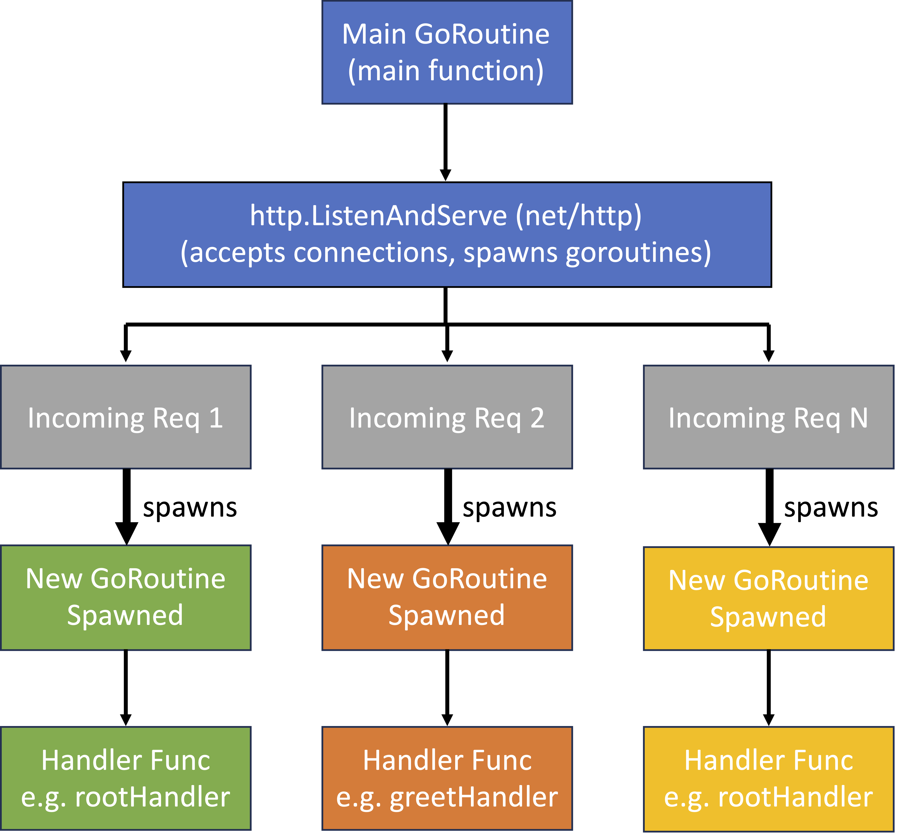

## Web Search

In this lab series, you'll build a document search web application in Go

Goals:

- Start with a simple standalone HTTP server

- Implement keyword-based document search

- Gradually evolve the system into a distributed search engine

By the end, you'll have:

- A scalable architecture

- Efficient indexing and query handling

- Multi-node search across large document sets

---
# HTTP Basics

<div class="columns">

<div>

Protocol to transport HTML documents from a server to a client web browser

Client browser makes an HTTP *Request* with some information

Server processes that *Request* and returns a *Response*.

</div>

<div>


</div>

</div>

---

# Introducing the `net/http` package

The http package provides the basics for serving web pages

```go
import "net/http"
```

Basic API:

`http.HandleFunc`: Registers a handler function for a specific route or URL path

`http.ListenAndServe`: Starts the HTTP server and listens for incoming requests on a specified address and port

---

# Setting Up a Simple Web Server


```go
package main

import (
    "fmt"
    "net/http"
)

func main() {
    http.HandleFunc("/", func(w http.ResponseWriter, r *http.Request) {
        fmt.Fprintln(w, "Hello, world!")
    })
    http.ListenAndServe(":8080", nil)
}
```

---

# Concurrency model

<div class="columns">

<div>

Main Goroutine 
- Runs main(), preloads files, registers routes
- Calls listenAndServe(): listens, accepts connections, and spawns goroutines per request

Request Goroutines
- Run the appropriate handler for each request

</div>

<div>



</div>

</div>

---

# Server skeleton implementation

We've provided a partial implementation to get you started:

```
cd labs/05-websearch/starter
```

Directory structure follows the [Standard Go Project Layout](https://github.com/golang-standards/project-layout)

- `/cmd`: contains the main application
- `/internal`: contains the private application and library code
- `/test`: contains additional external test apps and test data
- `/web`: contains web application specific components

---

# Serving the main page

- Set up the main entry point for the search app

- Serve a simple HTML form for user queries

- At `/`, serve `web/static/index.html` via `htmlHandler` in `cmd/webserver/main.go`

- `index.html` includes:

  - A search input form

  - JavaScript to send queries to `/api/search` via HTTP GET

- Forms the user-facing front end of the application

---

# Handling Search Queries

- Implement `searchHandler` for GET requests to `/api/search`

- Expects query param: `?q=keyword1 keyword2 ...`

- Handler steps:

  1. Extract and parse query string
  2. Normalize tokens (e.g. lowercase, strip punctuation)
  3. Look up keywords in the inverted index
  4. Return matching documents as JSON response

- Powers the core search functionality of the application

---

# Inverted Index

- Core data structure in document search engines

- Enables fast keyword lookups without scanning every document file

- Maps keywords to the list of documents where they appear

- Scales efficiently for large text corpora

---

# Inverted Index: Structure

Format:

```
<word>: <count> <file1>, <file2>, ..., <fileN>
...
```

Example:

```
destiny: 4 pg-dorian_gray.txt, pg-dracula.txt, pg-emma.txt, pg-grimm.txt
friendship: 3 pg-being_ernest.txt, pg-emma.txt, pg-les_miserables.txt
```

The word "destiny" appears in 4 documents

The word "friendship" appears in 3 documents

---
# Inverted Index: Implementation

- Provided in the package: `internal/invertedindex`

- Supports loading and querying the index by keyword

- Reads and parses the index file on every query

  - Correct but inefficient — adds overhead under high query load

  - Optimization: Preload index into memory for faster lookups (later)

---

# Building

Build the web search server:

```
go mod init github.com/ucy-coast/websearch
go mod tidy
go build ./cmd/...
```

Run the Hotel Map application:

```
./webserver -addr :8080 -index /test/invertedindex-small.txt
```

---

# Testing

Visit the public URL:

```
http://<node0-public>:8080
```

You should get a search form where you can type in queries


---

# Benchmarking

---

# Running a basic benchmark

Run a 30-second test with 10 workers and 1000 QPS each:

```bash
hey -z 30s -c 10 -q 1000 http://127.0.0.1:8080/api/search?q=legacy
```

-z: duration

-c: concurrent workers

-q: requests per worker per second

---

# Running a basic benchmark - Sample output highlights

```
Summary:
  Total:	30.0019 secs
  Slowest:	0.0154 secs
  Fastest:	0.0007 secs
  Average:	0.0029 secs
  Requests/sec:	3489.1004

Response time histogram:
  0.001 [1]     |
  0.002 [23287]	|■■■■■■■■■■■■■■
  0.004 [67539]	|■■■■■■■■■■■■■■■■■■■■■■■■■■■■■■■■■■■■■■■■
  ...

Latency distribution:
  ...
  99% in 0.0052 secs

Status code:  [200] 104680 responses
```

---

# Key metrics to watch

These metrics help identify bottlenecks and server capacity:

- Requests/sec: Throughput, how many requests your server handles per second

- Average Latency: Mean time per request, lower is better

- 99% Latency: Tail latency, measures worst-case performance under load

---

# Scaling the Load

Repeat tests with higher concurrency:

| Workers | Throughput (QPS) | Average Latency (s) | 99% Latency (s) |
|---------|------------------|---------------------|-----------------|
| 10      | 3489.1004        | 0.0029              | 0.0052          |
| 100     | 4582.1376        | 0.0218              | 0.0723          |
| 300     | 6874.3704        | 0.0436              | 0.2258          |
| 500     | 7925.0066        | 0.0630              | 0.3719          |

Keep increasing until QPS plateaus — this is the saturation point

---

# Exercises

- Top-K Filtering:
  
  Return only the top-K results to reduce data transfer and help users focus on the most relevant matches

- Preload Index into Memory:

  Load the index at startup to avoid repeated scans; improves latency and throughput at the cost of memory and startup time