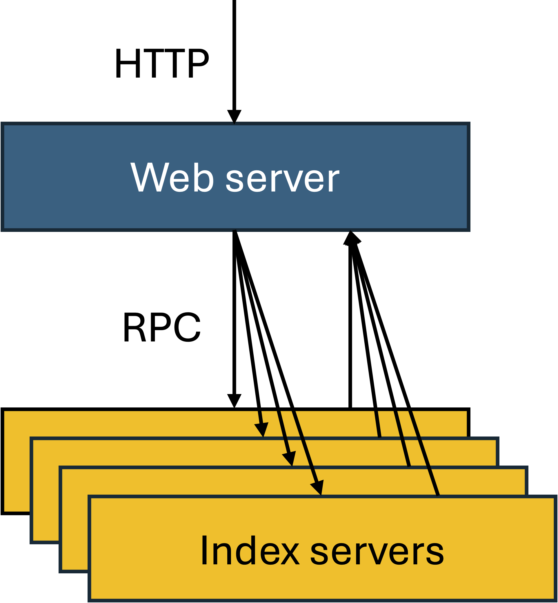

# Lab Goal

In this lab, you will extend your single-node search system into a **distributed search engine** using **Go's net/rpc** package.

By the end of the lab, you will have:

- A modular backend service that handles search requests over RPC
- A frontend that queries multiple backends in parallel
- Logic to merge search results across shards

---

# System Architecture

The system consists of:

- **Frontend server** (HTTP + RPC client)
- One or more **backend servers** (RPC servers)
- **Inverted index** split across multiple files (shards)

Each backend loads a shard and answers keyword search requests over RPC.

The frontend merges results from all backends and serves them over HTTP.

---

# Architecture Diagram



---

# Why RPC?

- RPC allows structured, typed communication across processes
- The `net/rpc` package in Go simplifies defining request/response types
- Enables backend servers to be separate processes or services

---

## Overview of Tasks

Your tasks for this lab:

- Define the RPC protocol (request and response structs)
- Refactor your backend into a standalone RPC service
- Modify the frontend to call multiple RPC backends
- Merge results in the frontend
- Test locally using provided shards and scripts

---

## Project Layout

```bash
.
├── cmd/
│   ├── indexserver/      # Backend RPC server
│   └── webserver/        # Web frontend + RPC client
├── internal/
│   ├── indexserver/      # Backend RPC server logic
│   ├── invertedindex/    # Inverted index logic
│   ├── rpc_api/          # Shared structs for RPC
│   └── webserver/        # Web frontend + RPC client logic
├── test/                 # Testing scripts and index data
└── web/
    └── static/           # HTML UI
```

---

# Shared RPC Types

Define shared RPC types in: `internal/rpc_api/search.go`

These types are used by both the backend and the frontend.

---

## Backend (indexserver)

- Load an inverted index shard from file

- Expose a Search method over RPC

- Register the service and start the RPC server

Tip: The RPC method should match Go’s RPC requirements:

```go
func (s *IndexServer) Search(args *SearchArgs, reply *[]SearchResult) error
```

---

# Frontend (webserver)

- Modify the HTTP handler to query all backend RPC servers
- Merge results using Top-K logic
- Return results as JSON to the browser

You'll need to:

- Parse `-shards` flag to get backend addresses
- Use `rpc.Dial` to connect to each backend
- Query each in parallel using goroutines
- Merge results by document match count

---

## Testing Setup

This lab is fully testable locally.

You simulate a distributed system by launching multiple processes on the same machine.

Provided resources:

Pre-partitioned index shards under test/shards/

Bash scripts to start multiple backend and frontend servers

Tool to partition a large index (optional)

---

# Testing Locally

Use the provided index shards in test/shards/

Start multiple indexserver processes (each loads one shard)

Start webserver with -shards pointing to all backends

Use browser or curl to query /api/search

Example:

```bash
curl "http://localhost:8080/api/search?q=legacy"
```

---

# Example Script

```bash
#!/bin/bash

# Launch 2 backends and a frontend

```bash
./bin/indexserver -rpc_addr="127.0.0.1:9090" -index_files="test/shards/shard0.txt" &
PID1=$!

./bin/indexserver -rpc_addr="127.0.0.1:9091" -index_files="test/shards/shard1.txt" &
PID2=$!

./bin/webserver -addr=":8080" -shards="127.0.0.1:9090,127.0.0.1:9091" &
```

Run curl or open browser...

---

# Tips

- Use sync.WaitGroup to wait for parallel RPC calls

- Don’t forget error handling (RPC errors, merging errors)

- Keep the interface and types clean (use rpc_api for shared structs)

---

# What You Should NOT Do

This is a distributed system simulation — avoid:

- Sharing memory between processes

- Hardcoding shard addresses (use flags)

- Merging results in the backend

All merging should happen in the frontend only

---

## What’s Next?

This RPC-based system is just the beginning.

It prepares your codebase for:

- Running on real clusters

- Load balancing

- Adding fault tolerance

- Kubernetes deployment

